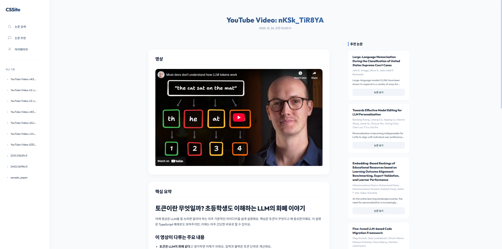

  <h3>안녕하세요, 재밌는 서비스를 만드는 김민재입니다.</h3>

  <h3>✨ Experience</h3>
  <ul>
    <li><a href="http://bioeng.hanyang.ac.kr/" target="_blank">한양대학교 생명공학과 졸업</a> 2017.03 - 2024.06</li>
    <li><a href="https://boostcamp.connect.or.kr" target="_blank">네이버 부스트캠프 웹·모바일 9기</a> 2024.06 - 2024.08</li>
    <li><a href="https://www.ssafy.com" target="_blank">삼성청년SW·AI아카데미(SSAFY) 14기</a> 2025.07 - 진행중</li>
  </ul>

  <h3>🛠️ Project</h3>
  <ul>
    <li>
      <a href="https://github.com/acapzed/cssite">CSSite</a>
      
      
AI 기반 CS 논문/영상 요약 및 맞춤형 학습 플랫폼

    </li>
    <li>
      <a href="https://github.com/acapzed/lostark-simulator">Lostark Simulator</a> 개발중
      
로스트아크 게임 시뮬레이터

    </li>
  </ul>
  
  <h3>😶‍🌫️ Thinking... </h3>
  

    &nbsp;
    &nbsp;
    &nbsp;
    &nbsp;
    &nbsp;
    &nbsp;
    &nbsp;
    &nbsp;
    &nbsp;
    &nbsp;
    &nbsp;
    &nbsp;
    &nbsp;
    &nbsp;
    &nbsp;
  

  <h3>🧩 Problem Solving</h3>
  

